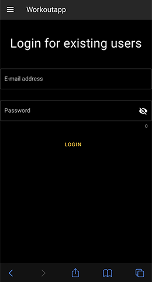
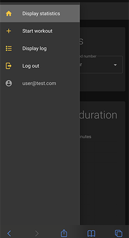
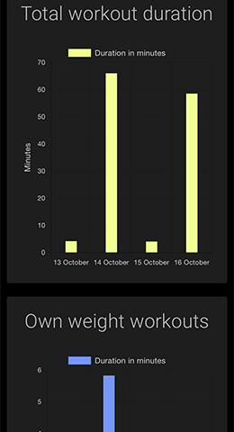
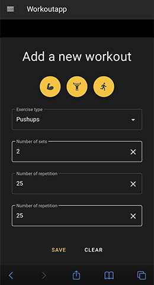
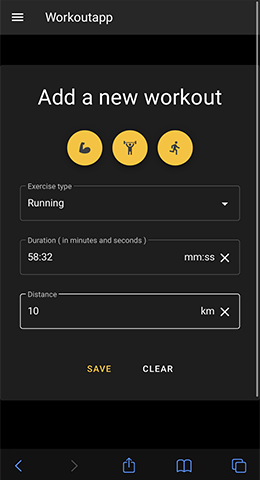
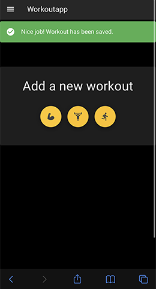
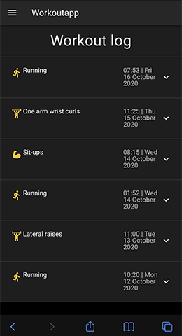
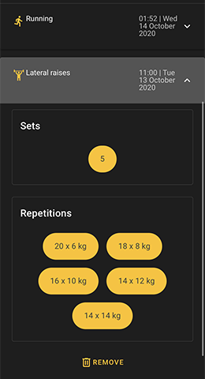

# Workout app

Workout tracking single page application.

## Stack

- Framework: Vue.js with Vuetify, Vuex, adn Vue CLI
- Libraries: Chart.js
- Database: Firestore
- Hosting and authentication with Firebase
- Form validation with Vuelidate

**Example screenshots**

